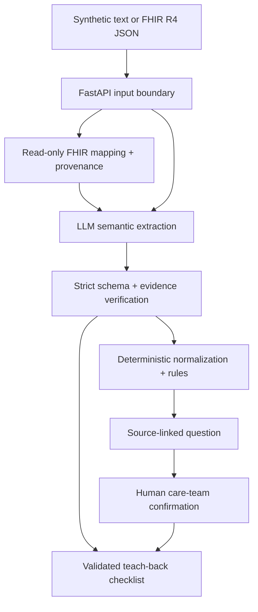

# CareAlign architecture

## Design objective

CareAlign reduces one narrow care-transition risk: a patient receiving instructions that appear to
differ across records. It does not diagnose, prescribe, reconcile on behalf of a clinician, or claim
that an absent flag proves safety.

## Data flow and trust boundaries

Document text is untrusted data, including text that resembles instructions to the model. The LLM
may propose structure; it may not provide the final conflict status. Unknown medication identity,
route, units, unsupported frequency patterns, low confidence or missing evidence cause review or
insufficient-information states.

## Backend modules

| Module | Responsibility | Safety property |
|---|---|---|
| `extraction.py` | Provider adapter and labelled synthetic demo parser | Untrusted-data prompt boundary; no inference instruction |
| `evidence.py` | Normalized exact and high-similarity span check | Untraced text cannot be displayed as validated |
| `normalization.py` | Decimal mass conversion, route and medication maps | Unknown equivalence is never guessed |
| `rxnorm.py` | Optional exact-first NLM terminology resolution | Normalized/ambiguous/unsupported lookup cannot become comparison identity |
| `fhir.py` | Read-only R4 medication import and date grouping | Identity fields ignored; dates/names never inferred |
| `conflicts.py` | Dose/frequency/route/action/omission checks | Deterministic, auditable and cannot choose the correct order |
| `teachback.py` | Source-derived checklist and supportive feedback | Conflicted/unvalidated items cannot become an answer key |
| `provider_guard.py` | Provider circuit breaker with cooldown | Repeated upstream faults fail fast instead of cascading |
| `observability.py` | Request IDs and structured operational events | Correlation without logging clinical text or secrets |
| `rate_limit.py` | Per-IP minute limit and live-analysis daily ceiling | Bounds abuse and denial-of-wallet exposure without charging teach-back |

## Operational provenance

Every analysis response records the app and deployment revision, model, prompt, rules and dataset
versions, request ID, provider call count, input/output token counts and elapsed analysis time. The
same validated request ID is returned in `X-Request-ID`, allowing a user-visible failure to be
correlated with structured server logs without logging the document body. `GET /api/health` is a
process liveness check; `GET /api/readiness` separately reports provider configuration and circuit
state.

[`release-manifest.json`](../release-manifest.json) contains SHA-256 hashes for the extraction,
evidence, normalization, conflict, terminology, teach-back, schema and evaluation artifacts. CI
fails if one of those files changes without regenerating the manifest, making an undeclared
safety-rule change visible before merge.

## State model

Analysis items are `validated`, `needs_review`, `insufficient_information`, or `invalid_output`.
Potential conflicts remain unresolved in server output. A care-team response is entered by the user,
marked unverified, and held only in browser `sessionStorage`; closing the tab or selecting **Clear all
session data** removes it. The AI cannot set a resolved status.

## Demo and live modes

Live mode uses the configured provider for strict JSON extraction. Demo Mode uses a conservative
parser only for synthetic text and is visibly labelled. Demo Mode is not a silent recovery path. In
either mode, deterministic validation and conflict rules are identical. A provider timeout, malformed
JSON, evidence failure, unknown unit or other exception must result in an unavailable or uncertain
state—not a reassuring no-conflict result.

## Privacy and deployment

The backend is stateless and has no application database or retrieval endpoint. Raw text logging is
off by default; structured logs contain paths, timings, counts and opaque correlation IDs only.
Production deploys the static Next.js client separately from the containerized
FastAPI service. CORS allows only the final frontend origin. The app is explicitly not configured for
PHI or represented as HIPAA compliant.

## Extension path

The request and UI accept 2–5 uniquely dated documents. The engine checks each longitudinal
transition and collapses duplicate alert types while preserving every contributing source.
The current FHIR boundary accepts pasted synthetic R4 JSON only; it has no EHR authorization,
network retrieval, write-back, or PHI-ready storage. Post-hackathon priorities are consented OAuth
integration, clinician-reviewed labels, multilingual plain language, prospective usability work,
and formal clinical/regulatory assessment.
Execution protocols and evidence forms for these gates live in [`research/`](../research/README.md).
